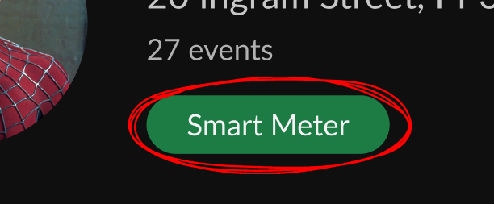

## Welcome to the Virgin Media O2 Coding Challenge 🎉

Thank you for your interest in joining us, check out the instructions below for our coding test!
We’re excited to see how you approach this challenge and can’t wait to dive into the awesome work you’ll deliver.

Here’s the deal: we’re asking you to build a simple frontend and backend that’ll display specific data at a dedicated URL. This is your chance to show off your skills with CSS-in-JS, TypeScript, and Express—so get comfortable and let your code do the talking.

### The Challenge

1. **Frontend Requirements**:
   - Set up a frontend route using React Router to display a "meter" record. When you visit `http://localhost:port/meter/{id}`, it should display data that corresponds to that ID.
   - **Design**: We’ve included a [wireframe, here](https://www.figma.com/design/ty5UkYwB6iWDsFLZzx6V8i/Frontend-Coding-Test?node-id=0-1&t=VKKWwlXSbe00mvp3-1) as a guide. Don’t worry too much about matching the precise spacing and sizes—just aim for the general visual feel. We’re more interested in seeing how you approach the layout and styling!
   - **CSS-in-JS**: You **must** use a CSS-in-JS library like `styled-components` or `@emotion` for all styling. Virgin Media O2 loves style, and we’re looking for a solution that makes the UI shine.
   - **Other Functional Requirements**: 
     - Only display the smart meter green pill\
      \
      when the user has a smart meter. 
     - For the device time, just utilise the HH:MM:SS of the timestamp for the record.

2. **Backend Requirements**:
   - Set up an Express endpoint to serve the data for the given ID.
   - The endpoint should be able to accept a meter ID and return the corresponding data to the frontend.
   - Use **TypeScript** for all backend logic—we’re big fans of strongly typed code here.
   - Use the data for this found in `services/backend/src/data.json`

3. **Tech Stack**:
   - **Frontend**: React with TypeScript, React Router, and a CSS-in-JS library of your choice - styled-components or @emotion (p.s. use more modern css e.g. `Flexbox`).
   - **Backend**: Express, TypeScript.
   - Feel free to use any other libraries or tools you think would be beneficial for this task on both the front and backend. We trust your judgement!

### What We’re Looking For

- **Clean, readable code** that’s easy to follow and maintain.
- **Attention to detail** with UI. Your work doesn’t need to be flashy, but it should be polished and professional.
- **Best practices** for organizing and structuring code, both frontend and backend.

### The Little Extras

- If you've added anything we'll need on our machines to run your project, instructions on how to add/run it would be awesome.
- If you have any queries before you get stuck in, feel free to email me at jordan.paisley@virginmediao2.co.uk

### Getting Started

1. Fork or clone this repository.
2. Set up your Express server (we've included an Express dev server starter, which you can run inside `services/backend` with `npm start`) and frontend(feel free to use any build tools to get yourself started).
3. Make sure everything works smoothly.

When you're ready, zip up your project or link us to your repo. 

Thanks again for taking part, and remember — this is your chance to show us your coding magic. 
Have fun, and may the best code win!

Happy coding! 🚀
